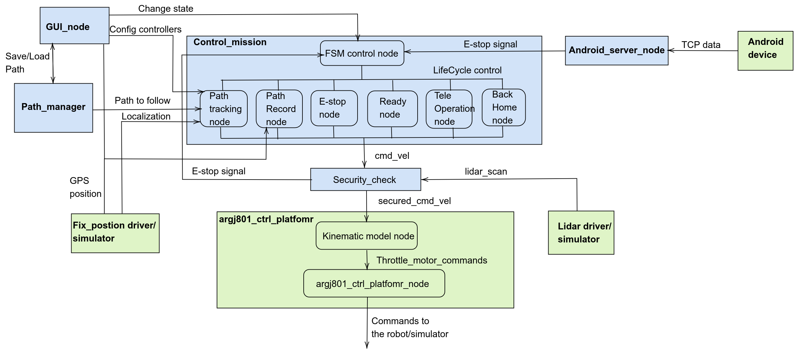

# Robotics Mechatronics Project

## Overview
This project is designed for advanced robotic control and simulation using ROS2. It integrates multiple packages to manage robot simulations, sensor data processing, and real-time control. The packages are added as [git submodules](https://git-scm.com/book/en/v2/Git-Tools-Submodules).

## Features
- **Simulation Models**: Gazebo simulation models for various robot configurations.
- **Sensor Integration**: Drivers for different sensors including Fixposition and Ublox.
- **Control Algorithms**: Advanced control algorithms for path management and mission control.
- **User Interface**: GUI for easy interaction and control of the robots.
- **Security Checks**: Modules to ensure safe and secure operation.

## Repository Structure
```
root
├── src/
│   ├── android_ros2_server
│   ├── argo_drivers_pkgs/
│   │   ├── Fixposition_driver_pkg
│   │   ├── argj801_sensors
│   │   ├── ntrip_client
│   │   └── ublox
│   ├── argj801_ctl_platform
│   ├── argj801_setup
│   ├── ctl_mission
│   ├── gazebo_sim_pkgs/
│   │   ├── fix_position_pkg
│   │   └── j8_xacro_model
│   ├── GUI_pkg
│   ├── j8_joystick
│   ├── lidar_process_pkgs
│   ├── path_manager
│   └── security_check
├── .gitmodules
└── README.md
```

## Installation

### Prerequisites
- **ROS2**: Make sure ROS2 is installed on your system. Follow the [ROS2 installation guide](https://docs.ros.org/en/foxy/Installation.html).
- **Dependencies**: Install additional dependencies required for the packages.

### Building the Workspace
```sh
# Clone the repository with submodules
git clone --recurse-submodules git@github.com:Robotics-Mechatronics-UMA/ARGOJ8_ws.git
cd ARGO_ws/

# Install dependencies
./install.sh

# Build the workspace
colcon build --symlink-install
```

## Usage

Launch and configuraiton to run all the nodes can be found in a [dedicated package](https://github.com/Robotics-Mechatronics-UMA/argj801_setup).


## Contributing
We welcome contributions! Please follow these guidelines:
- **Issues**: Use the GitHub issue tracker to report bugs or request features.
- **Pull Requests****: Submit pull requests for any improvements or bug fixes.
- **Coding Standards**: Follow the coding standards outlined in the repository.

## License
This project is licensed under the [MIT License](LICENSE).

## Acknowledgments
We would like to thank the contributors and the open-source community for their support and resources.

---

### Package Details
- **[android_ros2_server](https://github.com/Robotics-Mechatronics-UMA/Android_ros2_server_pkg.git)**: Provides an interface for ROS2 communication with Android devices.
- **argo_drivers_pkgs**: Contains drivers for various sensors including Fixposition and Ublox.
  - **[Fixposition_driver_pkg](https://github.com/Robotics-Mechatronics-UMA/Fixposition_driver_pkg.git)**: Driver package for Fixposition sensor integration.
  - **[argj801_sensors](https://github.com/Robotics-Mechatronics-UMA/argj801_sensors.git)**: Drivers for ArgJ801 robot sensors.
  - **[ntrip_client](https://github.com/Robotics-Mechatronics-UMA/ntrip_client.git)**: NTRIP client package for RTCM data streaming.
  - **[ublox](https://github.com/Robotics-Mechatronics-UMA/ublox.git)**: Driver package for Ublox GPS modules.
- **[argj801_ctl_platform](https://github.com/Robotics-Mechatronics-UMA/argj801_ctl_platform.git)**: Platform control algorithms for the ArgJ801 robot.
- **[argj801_setup](https://github.com/Robotics-Mechatronics-UMA/argj801_setup.git)**: Setup configurations for the ArgJ801 robot.
- **[ctl_mission](https://github.com/Robotics-Mechatronics-UMA/argj801_ctl_mission.git)**: Mission control algorithms for autonomous operations.
- **gazebo_sim_pkgs**: Gazebo simulation models and related packages.
  - **[fix_position_pkg](https://github.com/Robotics-Mechatronics-UMA/fix_position_pkg.git)**: Gazebo plugin for fixing positions in simulation.
  - **[j8_xacro_model](https://github.com/Robotics-Mechatronics-UMA/j8_xacro_model.git)**: Xacro models for J8 robot configurations in Gazebo.
- **[GUI_pkg](https://github.com/Robotics-Mechatronics-UMA/J8_GUI.git)**: Graphical User Interface for controlling and monitoring robots.
- **[j8_joystick](https://github.com/Robotics-Mechatronics-UMA/joystick_j8.git)**: Joystick driver for manual robot control.
- **[lidar_process_pkgs](https://github.com/Robotics-Mechatronics-UMA/lidar_process_pkgs.git)**: Packages for processing Lidar data.
- **[path_manager](https://github.com/Robotics-Mechatronics-UMA/path_manager.git)**: Path management algorithms for navigation.
- **[security_check](https://github.com/Robotics-Mechatronics-UMA/security_check.git)**: Modules to ensure safe and secure operation of robots.

## Diagram

A simplified functional diagram of the relations between all the nodes in the workspace is presented in the next 


# REMOTE CONECTION TO THE CONTROL CENTER

To communicate with the contol center or other robots, the Husarnet VPN is used
## Creating a network.  
  
First register and create a network in Husrnet, or use an existing one:  

## Installing Husarnet VPN client
Execute this command on each physical device you need to connect.

```
curl -s https://install.husarnet.com/install.sh | sudo bash
```

### Creating a Husarnet group
Add your physical devices to the same Husarnet group, by executing following commands on each of them:

```
husarnet join <your-join-code> <device-hostname>

```


### Configuration of the DDS:  
  
Husarnet-DDS is a utility that automates the generation of DDS XML configuration files for Husarnet.

First, install Husarnet-DDS on each device in your Husarnet group (eg. on your robot and your laptop) from GitHub releases (available for Linux, MacOS, and Windows), eg. on Ubuntu:

```
RELEASE="v1.3.5"
ARCH="amd64"

sudo curl -L https://github.com/husarnet/husarnet-dds/releases/download/$RELEASE/husarnet-dds-linux-$ARCH -o /usr/local/bin/husarnet-dds
sudo chmod +x /usr/local/bin/husarnet-dds
```

Next, choose the DDS implementation that you want to use with your ROS 2 application. Husarnet-DDS supports both Fast DDS and Cyclone DDS.

Set up the required environment variables based on your chosen DDS implementation on each device in your ROS 2 network (eg. on your robot and your laptop), or add it to the .bashrc.

```
export RMW_IMPLEMENTATION=rmw_fastrtps_cpp
export FASTRTPS_DEFAULT_PROFILES_FILE=/var/tmp/husarnet-fastdds-simple.xml
husarnet-dds singleshot
```
Check that the remote center and the robot are online in the specific network in the [Husarnet Dashboard](https://app.husarnet.com/):  
  
  


