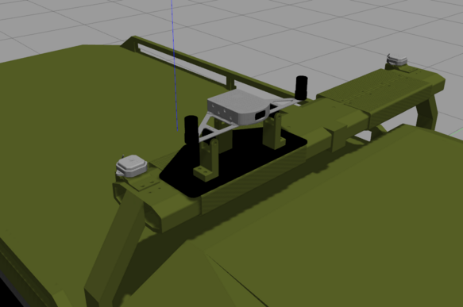

# Fixposition Gazebo Simulator
This package contains a Gazebo simulator of the  [fixposition](https://www.fixposition.com) localization device. In this way, a realistic 3D model and a custom Gazebo plugin have been used to replicate the output of the original ROS driver.

## URDF
The sensor simulator is modeled in URDF, to be easily included on a simulated robot. In order to add the sensor, the macro should be first included with:

```
  <xacro:include filename="$(find fixposition_sensor_pkg)/urdf/fixposition_main.xacro"/>

```
Then, the sensor can be added to the robot as, at the origin (x_o, y_o, z_o) with an orientation (r_o, y_o, z_o) from a parent_frame with:  

``` 
  <xacro:fixposition_full_setup parent="parent_frame" xyz=" x_o y_o z_o " rpy="r_o p_o y_o"/>
```


## Output of the plugin

The Gazebo plugin have been modeled to produce a result as similar as possible to the ROS driver of the real device, allowing code development and testing that can be transferred to a real robot without additional modifications.

 **<span style="color:red;">IMPORTANT</span>**: The plugin uses the GPS simulation in Gazebo to generate the sensor GPS data, as well as the ECEF frame. The GPS cordinate of the Gazebo reference system has to be set in the world definition, typically:  

```
<world name="default">
   <spherical_coordinates>
       <latitude_deg>36.717083</latitude_deg>
      <longitude_deg>-4.489455</longitude_deg>
      <heading_deg>180</heading_deg>
    </spherical_coordinates>
```

### Messages and TF tree

The output is published on the following:

#### Vision-RTK2 Fusion

-   From **FP_A-ODOMETRY**, at the configured frequency (default 10Hz, output generator -> Fusion frequency):

    -   Messages

    | Topic                       | Message Type              | Frequency                      | Description                                                                                                                                                   |
    | --------------------------- | ------------------------- | ------------------------------ | ------------------------------------------------------------------------------------------------------------------------------------------------------------- |
    | `/fixposition/odometry`     | `nav_msgs/Odometry`       | as configured on Gazebo plugin | Position, Orientation from ECEF to FP_POI, Velocity and Angular Velocity in FP_POI                                                                            |
    | `/fixposition/odomsh`       | `nav_msgs/Odometry`       | as configured on Gazebo plugin | Position, Orientation from ECEF to FP_POI, Velocity and Angular Velocity in FP_POI. Based on smooth odometry output. **<span style="color:red;">To be implemented</span>**                                         |
    | `/fixposition/odometry_enu` | `nav_msgs/Odometry`       | as configured on Gazebo plugin | Position, Orientation from ENU0 to FP_POI, Velocity and Angular Velocity in FP_POI                                                                            |
    | `/fixposition/vrtk`         | `fixposition_driver/VRTK` | as configured on Gazebo plugin | Custom Message containing same Odometry information as well as status flags                                                                            **<span style="color:red;">To be implemented</span>**                                         |
    | `/fixposition/poiimu`       | `sensor_msgs/Imu`         | as configured on Gazebo plugin | Bias Corrected acceleration and rotation rate in FP_POI                                                                                                       |
    | `/fixposition/ypr`          | `geometry_msgs/Vector3`   | as configured on Gazebo plugin | x = Yaw, y = Pitch, z = Roll in radian. Euler angles representation of rotation between ENU and P_POI. Only available after fusion initialization.            |

-   From **FP_A-LLH**, at the configured frequency (default 10Hz, output generator -> Fusion frequency):

    | Topic                    | Message Type            | Frequency                      | Description                    |
    | ------------------------ | ----------------------- | ------------------------------ | ------------------------------ |
    | `/fixposition/navsatfix` | `sensor_msgs/NavSatFix` | as configured on Gazebo plugin | Latitude, Longitude and Height |

#### Vision-RTK2 GNSS Antenna Positions


-   From the Gazebo reference frame, converted to LLH at the configured frequency, GNSS1 and GNSS2 raw antenna positions (default 5Hz):

    | Topic                | Message Type            | Frequency                      | Description                    |
    | -------------------- | ----------------------- | ------------------------------ | ------------------------------ |
    | `/fixposition/gnss1` | `sensor_msgs/NavSatFix` | as configured on Gazebo plugin | Latitude, Longitude and Height |
    | `/fixposition/gnss2` | `sensor_msgs/NavSatFix` | as configured on Gazebo plugin | Latitude, Longitude and Height |


#### Vision-RTK2 IMU data

-   From **FP_A-RAWIMU**, at 200Hz:

    | Topic                 | Message Type      | Frequency | Description                                                                               |
    | --------------------- | ----------------- | --------- | ----------------------------------------------------------------------------------------- |
    | `/fixposition/rawimu` | `sensor_msgs/Imu` | 200Hz     | Raw (without bias correction) IMU acceleration and angular velocity data in FP_VRTK frame |

-   From **FP_A-CORRIMU**, at 200Hz:

    | Topic                  | Message Type      | Frequency | Description                                                                |
    | ---------------------- | ----------------- | --------- | -------------------------------------------------------------------------- |
    | `/fixposition/corrimu` | `sensor_msgs/Imu` | 200Hz     | Bias Corrected IMU acceleration and angular velocity data in FP_VRTK frame |

-   From **FP_A-TF_POIIMUH**, at 200Hz:

    | Topic                    | Message Type            | Frequency                      | Description                    |
    | ------------------------ | ----------------------- | ------------------------------ | ------------------------------ |
    | `/fixposition/imu_ypr`   | `geometry_msgs/Vector3` | 200Hz                          | x = 0.0, y = Pitch, z = Roll in radian. Euler angles representation of rotation between a local horizontal frame and P_POI. Rough estimation using IMU alone. |

#### Transforms

-   TFs:
    | Frames             | Topic        | Message needed to be selected on web-interface | Frequency                      |
    | ------------------ | ------------ | ---------------------------------------------- | ------------------------------ |
    | `ECEF-->FP_POI`    | `/tf`        | `ODOMETRY`                                     | as configured on Gazebo plugin |
    | `ECEF-->FP_ENU`    | `/tf`        | `ODOMETRY`                                     | as configured on Gazebo plugin |
    | `ECEF-->FP_ENU0`   | `/tf`        | `ODOMETRY`                                     | as configured on Gazebo plugin |
    | `FP_POI-->FP_IMUH` | `/tf`        | `ODOMETRY`                                     | 200Hz                          |
    | `FP_POI-->FP_VRTK` | `/tf_static` | `TF_POI_VRTK`                                  | 1Hz                            |
    | `FP_VRTK-->FP_CAM` | `/tf_static` | `TF_VRTK_CAM`                                  | 1Hz                            |

-   ROS TF Tree:

    ```mermaid
    graph TD;
    ECEF-->FP_POI-->FP_VRTK-->FP_CAM
    FP_POI-->FP_IMUH
    ECEF-->FP_ENU
    ECEF-->FP_ENU0
    ```

_Please note that the corresponding messages also has to be selected on the Fixposition V-RTK's configuration interface._

### Explaination of frame ids

| Frame ID    | Explaination                                                                                                                                   |
| ----------- | ---------------------------------------------------------------------------------------------------------------------------------------------- |
| **ECEF**    | Earth-Center-Earth-Fixed frame.                                                                                                                |
| **FP_VRTK** | The coordinate frame on the V-RTK's housing on the Fixposition-Logo "X".                                                                       |
| **FP_POI**  | Point-Of-Interest, configured from V-RTK's web-interface with respect to the FP_VRTK frame. By default it is the same as FP_VRTK.              |
| **FP_ENU**  | The **local** East-North-Up coordinate frame with the origin at the same location as FP_POI.                                                   |
| **FP_ENU0** | The **global fixed** East-North-Up coordinate frame with the origin at the first received ODOMETRY position. Needed for visualization in Rviz. |
| **FP_CAM**  | The camera coordinate frame of the V-RTK.                                                                                                     **<span style="color:red;">To be implemented</span>**                                         |
| **FP_IMUH** | A local horizontal frame with the origin at the same location as FP_POI. This frame is a rough estimate determined by the IMU alone.           |


