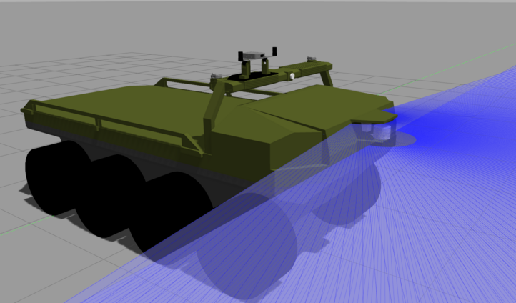

# j8_xacro_model

J8_xacro model is a ROS2 package to simulate the ARGOJ8 wheeled robot. It contains the meshes, URDF/Xacro description, and a realistic configuration of all its sensors and motors.



The J8 has been modeled using SolidWorks, and then converted to URDF using the tool [SolidWorks to URDF Exporter](http://wiki.ros.org/sw_urdf_exporter). A detailed tutorial of the tool can be found [here](http://wiki.ros.org/sw_urdf_exporter/Tutorials/Export%20an%20Assembly).

## Directory Structure

```
j8_xacro_model/
├── .git/                 # Git repository files
├── CMakeLists.txt        # CMake build configuration
├── Readme.md             # Documentation file
├── drawings/             # Drawings related to the model
├── imgs/                 # Images used in the documentation
├── include/              # Header files (if any)
├── launch/               # Launch files for ROS2
├── meshes/               # Mesh files used in the URDF
├── model.config          # Model configuration file for Gazebo
├── package.xml           # Package configuration file
├── src/                  # Source files
│   └── gazebo_ros_j8_wheels_speed.cpp  # Custom plugin or node for Gazebo
├── urdf/                 # URDF and Xacro files
│   ├── argo_j8.urdf.xacro
│   ├── camera.xacro
│   ├── fixposition_holder.xacro
│   ├── fixposition_sensor.xacro
│   ├── gps.xacro
│   ├── gps_holder.xacro
│   ├── lidar.xacro
│   ├── panel.xacro
│   ├── set_color.xacro
│   ├── sick_lidar.urdf.xacro
│   ├── side_bar.xacro
│   ├── test.urdf
│   ├── wheel.urdf.xacro
├── worlds/               # Gazebo world files
│   └── empty_custom.world
```

## Overview

This package sets up a simulation environment for a robot defined by Xacro and URDF files and allows it to be spawned in a Gazebo world. The `start_gazebo_j8.launch.py` launch file handles the simulation startup, including the robot's initial pose and the option to run Gazebo with or without a GUI.

## Dependencies

Ensure you have the following dependencies installed:

- ROS2 Foxy (or later)
- Gazebo
- `xacro`
- `robot_state_publisher`
- `gazebo_ros`

## Launch Files

The main launch file is located in the `launch` directory:

- `launch/start_gazebo_j8.launch.py`

This launch file processes a Xacro file to generate a URDF, sets an initial pose for the robot, and spawns the robot in a Gazebo world.

## Running the Simulation

To run the simulation with GUI:

```bash
ros2 launch j8_xacro_model start_gazebo_j8.launch.py gui:=true
```

To run the simulation without GUI (headless):

```bash
ros2 launch j8_xacro_model start_gazebo_j8.launch.py gui:=false
```

### Initial Pose

The initial pose of the robot can be adjusted in the `start_gazebo_j8.launch.py` file. The pose is defined by the following parameters:

- `-x`: X-coordinate
- `-y`: Y-coordinate
- `-z`: Z-coordinate
- `-R`: Roll
- `-P`: Pitch
- `-Y`: Yaw

Example pose in the launch file:
```python
initial_pose = ['-x', '7.18', '-y', '6.09', '-z', '0.55', '-R', '0.0', '-P', '0.0', '-Y', '2.22']
```

### URDF/Xacro Files

The URDF and Xacro files that define the robot's model are located in the `urdf` directory. Key files include:

- `argo_j8.urdf.xacro`: Main URDF file for the robot.
- Additional Xacro files defining various components such as cameras, GPS, lidar, etc.

### Gazebo World Files

The Gazebo world file used for the simulation is located in the `worlds` directory:

- `empty_custom.world`: Custom empty world for simulation.

### ROS2 Topics

The simulator generates several ROS2 topics for communication:

- **Right Side GPS Fix**:
  - Topic: `/ARGJ801/base/gps/fix`
  - Description: Publishes GPS fix data for the right side.

- **Right Side GPS Velocity**:
  - Topic: `/ARGJ801/base/gps/vel`
  - Description: Publishes GPS velocity data for the right side.

- **Command Throttle**:
  - Topic: `/ARGJ801/cmd_throttle_msg`
  - Description: Subscribes to throttle commands.

- **Odometry**:
  - Topic: `/ARGJ801/odom_demo`
  - Description: Publishes odometry information including the position and orientation of the robot.

- **Left Side GPS Fix**:
  - Topic: `/ARGJ801/rover/gps/fix`
  - Description: Publishes GPS fix data for the left side.

- **Left Side GPS Velocity**:
  - Topic: `/ARGJ801/rover/gps/vel`
  - Description: Publishes GPS velocity data for the left side.

- **Sick Lidar Scan**:
  - Topic: `/ARGJ801/sick_scan`
  - Description: Publishes scan data from the Sick lidar sensor.

- **Velodyne Lidar Scan**:
  - Topic: `/ARGJ801/velodyne_scan`
  - Description: Publishes scan data from the Velodyne lidar sensor.

## Custom Plugins

The `src` directory contains custom plugins or nodes. Notable file:

- `gazebo_ros_j8_wheels_speed.cpp`: Custom plugin for controlling the robot's wheel speed in Gazebo.

## Contributing

Contributions are welcome! Please follow the standard Git workflow:

1. Fork the repository
2. Create a new branch (`git checkout -b feature-branch`)
3. Make your changes
4. Commit your changes (`git commit -am 'Add new feature'`)
5. Push to the branch (`git push origin feature-branch`)
6. Create a new Pull Request

## License

This project is licensed under the MIT License - see the `LICENSE` file for details.

## Acknowledgments

- Special thanks to all contributors and the ROS community.

## Contact

For questions or suggestions, feel free to contact the project maintainers.
